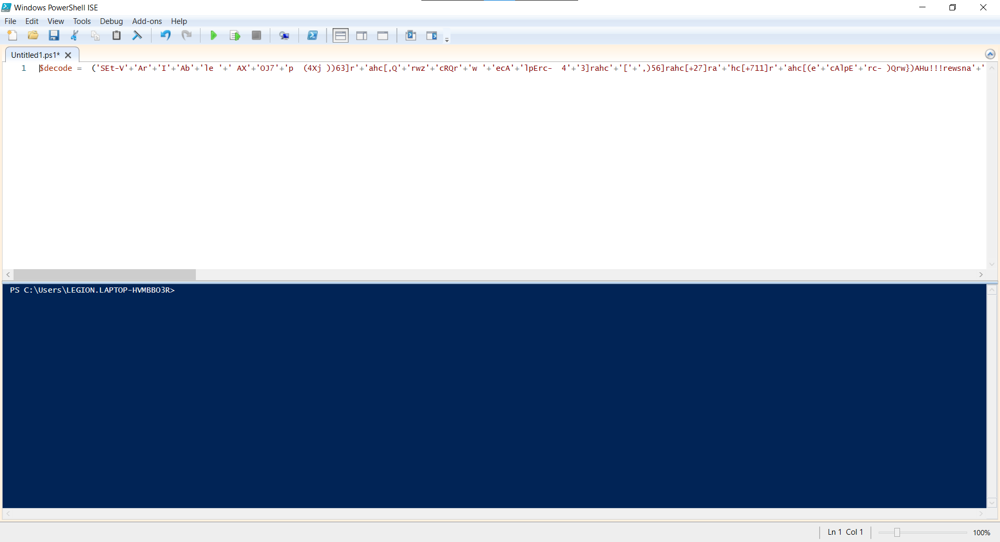
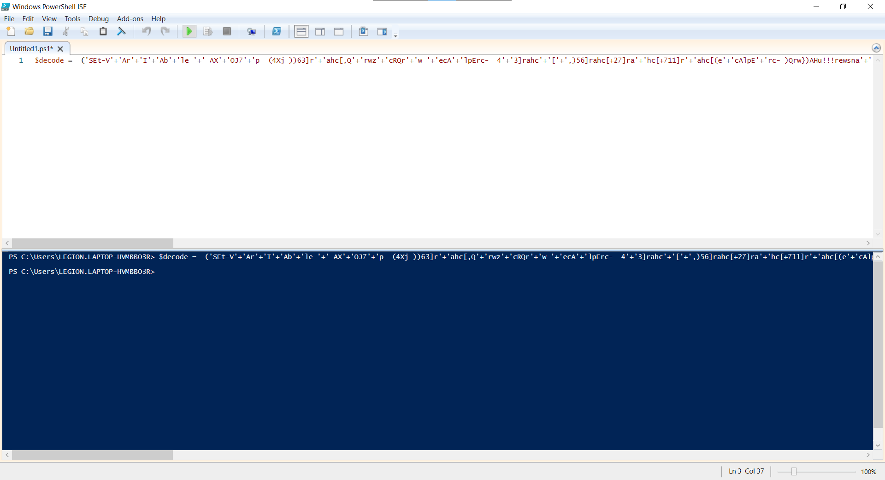

Remove the IEX at the end of the script together witht the pipe `|.( $sHElLId[1]+$SHeLLid[13]+'X')`

```powershell
 ('SEt-V'+'Ar'+'I'+'Ab'+'le '+' AX'+'OJ7'+'p  (4Xj ))63]r'+'ahc[,Q'+'rwz'+'cRQr'+'w '+'ecA'+'lpErc-  4'+'3]rahc'+'['+',)56]rahc[+27]ra'+'hc[+711]r'+'ahc[(e'+'cAlpE'+'rc- )Qrw})AHu!!!rewsna'+' rof Qr'+'w'+'+QrwnQrw'+'+'+'QrwioctiQrw+'+'QrwB 01'+' Q'+'rw'+'+Qrwem yaPQrw+QrwAHu(Qr'+'w+QrwtQrw+Q'+'rwsoh-etirW{esle})AHurebycQrw+Qrwm0'+'sQr'+'w'+'+'+'Q'+'r'+'w'+'n'+'Qrw'+'+Qr'+'w'+'aRer0M0'+'NsfQrw+Qr'+'wAHu'+'(tsoh-et'+'Qrw'+'+Q'+'rwi'+'rW{)0'+'Qrw+Qrw1 '+'eQrw+'+'Qrwl- xzcR( Qrw+Q'+'rwfi;Qrw+Qr'+'w02=xzcRQ'+'rw((()Qr'+'wxQrw+]31[DIlLEHS4'+'xk+]'+'1['+'dILlEhs4xk (. 4X'+'j'+'  '+') ; . ( 4xke'+'Nv:COmSpEC['+'4,'+'26,25]-jOiNQrw'+'Qrw)('+'4X'+'j'+'4xk(Set'+'  Q'+'rw'+'Of'+'SQ'+'r'+'w  QrwQrw) 4Xj'+' + [STRING]'+' ('+'4'+'xkA'+'X'+'oj7'+'p['+' -1'+' ..'+'-( '+'4xkAXoj7p.LENGth '+') ])+4X'+'j 4x'+'k( '+'seT'+'-vaR'+'iaBLE '+'QrwOFsQrw  '+'Q'+'rw'+' Q'+'rw)4Xj )').repLacE(([char]52+[char]120+[char]107),'$').repLacE(([char]81+[char]114+[char]119),[StrinG][char]39).repLacE(([char]52+[char]88+[char]106),[StrinG][char]34)
 ```

 Open Powershell ISE editor and assigned it to a variable



Run the script



Look at the result

```powershell
PS C:\Users\LEGION.LAPTOP-HVMBBO3R> echo $decode
SEt-VArIAble  AXOJ7p  (" ))63]rahc[,'zcR' ecAlpErc-  43]rahc[,)56]rahc[+27]rahc[+711]rahc[(ecAlpErc- )'})AHu!!!rewsna rof '+'n'+'iocti'+'B 01 '+'em yaP'+'AHu('+'t'+'soh-etirW{esle})AHurebyc'+'m0s'+'n'+'aRer0M0Nsf'+'AHu(tsoh-et'+'irW{)0'+'1 e'+'l- xzcR( '+'fi;'+'02=xzcR'((()'x'+]31[DIlLEHS$+]1[dILlEhs$ (. "  ) ; . ( $eNv:COmSpEC[4,26,25]-jOiN'')("$(Set  'OfS'  '') " + [STRING] ($AXoj7p[ -1 ..-( $AXoj7p.LENGth ) ])+" $( seT-vaRiaBLE 'OFs'  ' ')" )
```

There seem to be reversed string

```
" ))63]rahc[,'zcR' ecAlpErc-  43]rahc[,)56]rahc[+27]rahc[+711]rahc[(ecAlpErc- )'})AHu!!!rewsna rof '+'n'+'iocti'+'B 01 '+'em yaP'+'AHu('+'t'+'soh-etirW{esle})AHurebyc'+'m0s'+'n'+'aRer0M0Nsf'+'AHu(tsoh-et'+'irW{)0'+'1 e'+'l- xzcR( '+'fi;'+'02=xzcR'((()'x'+]31[DIlLEHS$+]1[dILlEhs$ (. "
```

result

```
" .( $shElLId[1]+$SHELlID[13]+'x')((('Rczx=20'+';if'+' (Rczx -l'+'e 1'+'0){Wri'+'te-host(uHA'+'fsN0M0reRa'+'n'+'s0m'+'cyberuHA)}else{Write-hos'+'t'+'(uHA'+'Pay me'+' 10 B'+'itcoi'+'n'+' for answer!!!uHA)}') -crEplAce([char]117+[char]72+[char]65),[char]34  -crEplAce 'Rcz',[char]36)) "
```

There is IEX again, remove it

```powershell
SEt-VArIAble  AXOJ7p  (" ))63]rahc[,'zcR' ecAlpErc-  43]rahc[,)56]rahc[+27]rahc[+711]rahc[(ecAlpErc- )'})AHu!!!rewsna rof '+'n'+'iocti'+'B 01 '+'em yaP'+'AHu('+'t'+'soh-etirW{esle})AHurebyc'+'m0s'+'n'+'aRer0M0Nsf'+'AHu(tsoh-et'+'irW{)0'+'1 e'+'l- xzcR( '+'fi;'+'02=xzcR'((( "  ) ; . ( $eNv:COmSpEC[4,26,25]-jOiN'')("$(Set  'OfS'  '') " + [STRING] ($AXoj7p[ -1 ..-( $AXoj7p.LENGth ) ])+" $( seT-vaRiaBLE 'OFs'  ' ')" )
```

Try executing it again

```powershell
PS C:\Users\LEGION.LAPTOP-HVMBBO3R> $decode_1 = SEt-VArIAble  AXOJ7p  (" ))63]rahc[,'zcR' ecAlpErc-  43]rahc[,)56]rahc[+27]rahc[+711]rahc[(ecAlpErc- )'})AHu!!!rewsna rof '+'n'+'iocti'+'B 01 '+'em yaP'+'AHu('+'t'+'soh-etirW{esle})AHurebyc'+'m0s'+'n'+'aRer0M0Nsf'+'AHu(tsoh-et'+'irW{)0'+'1 e'+'l- xzcR( '+'fi;'+'02=xzcR'((( "  ) ; . ( $eNv:COmSpEC[4,26,25]-jOiN'')("$(Set  'OfS'  '') " + [STRING] ($AXoj7p[ -1 ..-( $AXoj7p.LENGth ) ])+" $( seT-vaRiaBLE 'OFs'  ' ')" )
$x=20;if ($x -le 10){Write-host("fsN0M0reRans0mcyber")}else{Write-host("Pay me 10 Bitcoin for answer!!!")}
```

flag: `fsN0M0reRans0mcyber`
