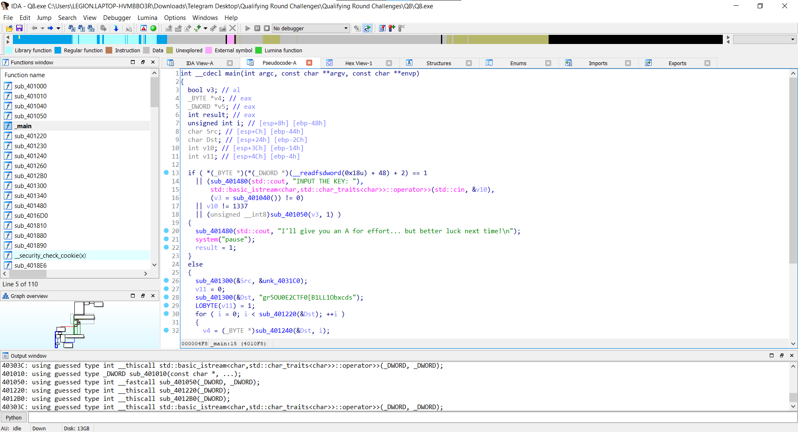
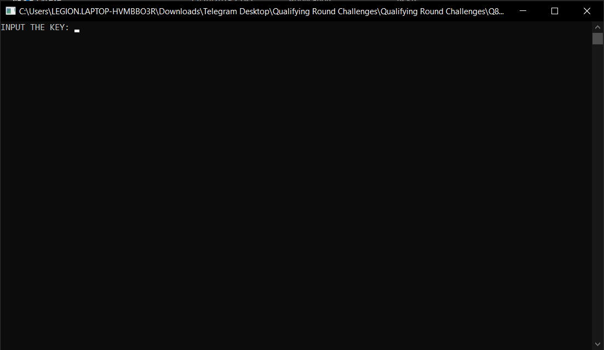
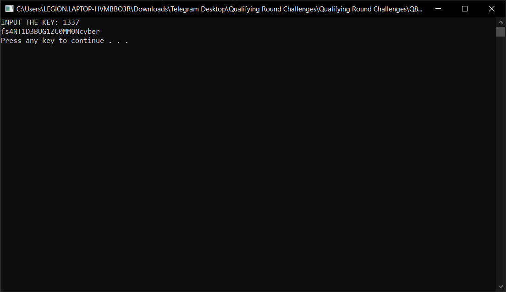

Debug in IDA Pro

From the execution of the program

We found the string `INPUT THE KEY` and locate it inside IDA

Our input is stored in `v10` from the `std::cin` function and it is compared with `v10 != 1337`

If our input is `1337` then we will execute the `else` block

